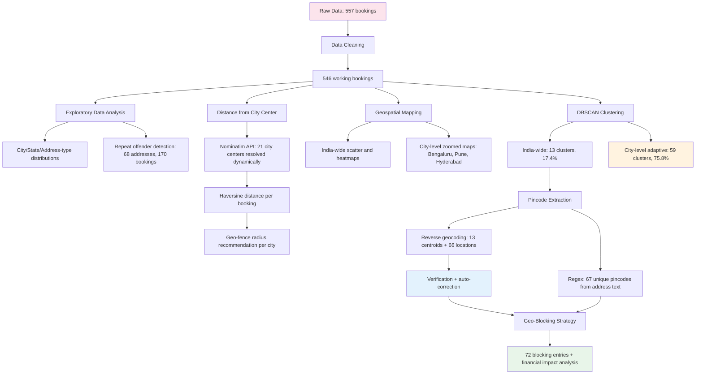
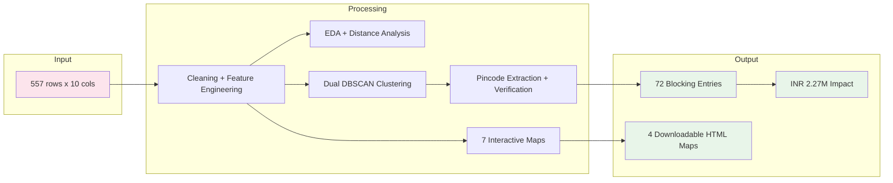
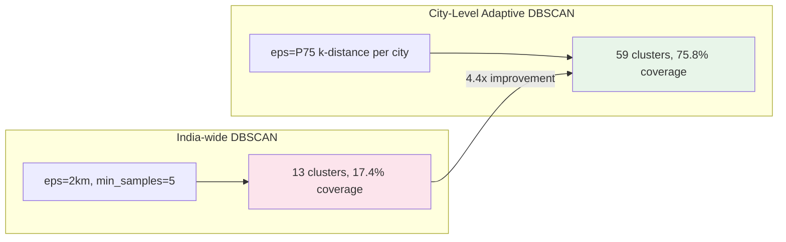
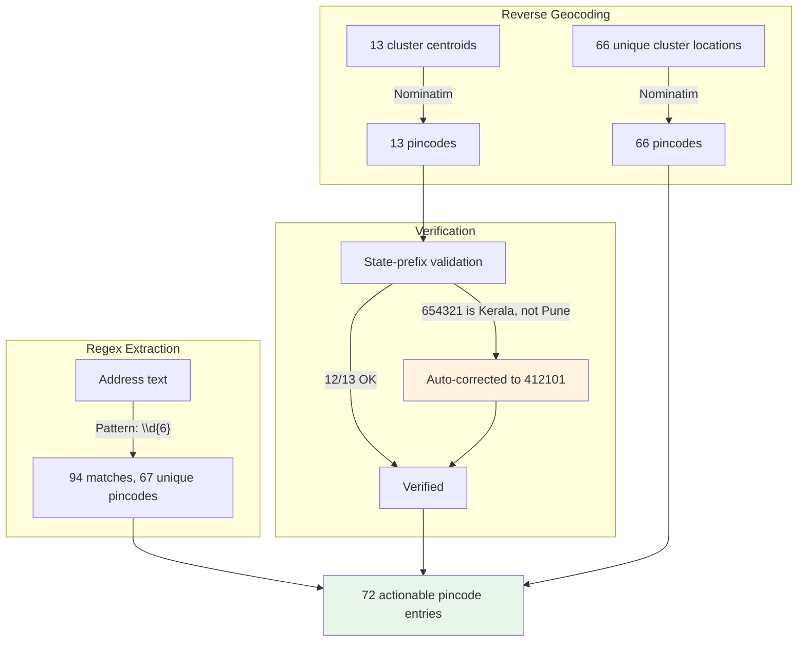
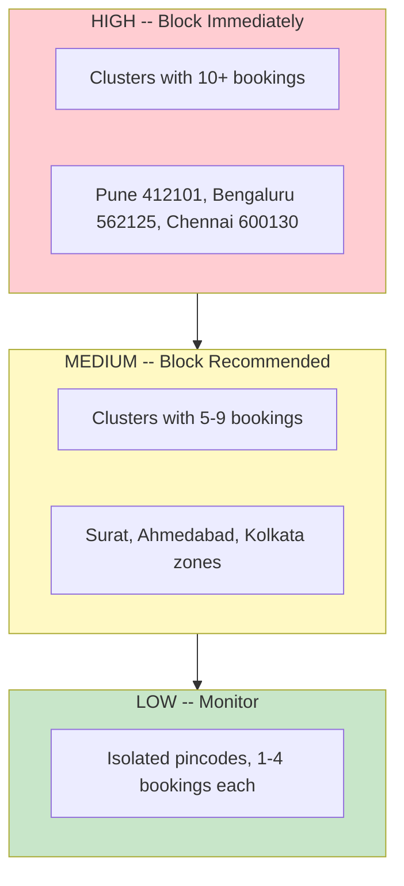

# COOX Outskirt Booking Analysis and Geo-Blocking Strategy

**Tech GC 2026 | IIT Roorkee x COOX Problem Statement**

**[View Notebook on Google Colab](https://colab.research.google.com/drive/1bghYiCkpljnBE1RhdJr8Az2f7WkvOZ9g?usp=sharing)**

---

## Problem Statement

COOX is a chef-at-home services platform that receives bookings from locations outside its serviceable areas -- typically city outskirts, remote farmhouses, and industrial zones. These bookings are unfulfillable and result in full refunds, causing revenue leakage, operational overhead, and degraded customer experience.

**Objective:** Analyze 557 non-serviceable bookings to identify geographic patterns, extract actionable pincodes, and recommend a data-driven geo-blocking strategy.

---

## Key Results

| Metric | Value |
|--------|-------|
| Working Dataset | 546 bookings (11 dropped for missing coordinates) |
| Cities Covered | 21 across 14 states |
| Top 3 Problem Cities | Bengaluru (26.2%), Pune (17.2%), Hyderabad (12.5%) |
| Median Distance from City Center | 21.1 km |
| India-wide DBSCAN Clusters | 13 clusters, 95 bookings (17.4%) |
| City-Level Adaptive DBSCAN | 59 clusters, 414 bookings (75.8%) |
| Silhouette Score | 0.940 |
| Comprehensive Blocking Entries | 72 (13 cluster-based + 59 address-based) |
| Estimated Financial Impact | INR 2,265,900 |
| Projected Annual Savings (80%) | INR 1,812,720 |

---

## Methodology



---

## Analysis Pipeline



---

## Clustering Strategy

Two levels of DBSCAN are applied to maximize geographic coverage:



| City | eps (km) | Clusters | Coverage |
|------|----------|----------|----------|
| Bengaluru | 4.1 | 14 | 79.0% |
| Pune | 4.0 | 7 | 74.5% |
| Hyderabad | 7.4 | 7 | 79.4% |
| Chennai | 3.6 | 9 | 75.8% |
| Ahmedabad | 4.1 | 3 | 81.6% |
| Jaipur | 8.7 | 3 | 84.0% |
| Kolkata | 8.9 | 3 | 88.9% |

---

## Pincode Extraction Pipeline



---

## Geo-Fence Recommendations

City centers resolved dynamically via Nominatim. The 25th percentile of booking distances used as the recommended blocking radius (prevents 75% of outskirt bookings).

| City | Bookings | Median Distance | Recommended Geo-fence |
|------|----------|----------------|-----------------------|
| Bengaluru | 143 | 22.1 km | 19 km |
| Pune | 94 | 19.5 km | 15 km |
| Hyderabad | 68 | 26.2 km | 22 km |
| Chennai | 66 | 26.5 km | 21 km |
| Ahmedabad | 38 | 15.8 km | 14 km |
| Jaipur | 25 | 20.8 km | 16 km |

---

## Blocking Priority Tiers



---

## Financial Impact

| Metric | Value |
|--------|-------|
| Revenue at Risk | INR 2,184,000 |
| Processing Waste | INR 81,900 |
| Total Impact | INR 2,265,900 |
| Projected Annual Savings (80% prevention) | INR 1,812,720 |
| Projected Monthly Savings | INR 151,060 |

---

## Repository Structure

```
oox-outskirt-geoblocking-analysis/
|-- README.md
|-- COOX_Outskirt_Analysis_final.ipynb
|-- data/
    |-- IIT Roorkee __ COOX - Raw Data.csv
```

---

## Setup and Execution

1. Open the [Google Colab notebook](https://colab.research.google.com/drive/1bghYiCkpljnBE1RhdJr8Az2f7WkvOZ9g?usp=sharing)
2. Upload the CSV from `data/` to the Colab file panel
3. `Runtime` > `Run All`
4. Total runtime: 5-8 minutes (API rate-limited sections)

### Dependencies

pandas, numpy, matplotlib, seaborn, folium, scikit-learn, geopy

---

## Notebook Sections

| # | Section | Key Output |
|---|---------|-----------|
| 1 | Setup and Data Loading | 557 rows x 10 columns |
| 2 | Data Cleaning | 546 clean bookings |
| 3 | Exploratory Data Analysis | City/state distributions, repeat offenders |
| 3.1 | Distance from City Center | Median 21.1 km, geo-fence radii |
| 4 | Geospatial Visualization | 7 interactive maps |
| 5 | DBSCAN Clustering | 13 India-wide + 59 city-level clusters |
| 6 | Pincode Extraction | 72 verified pincodes |
| 7 | Geo-Blocking Recommendation | Tiered blocking list, financial impact |
| 8 | Limitations and Future Work | Enhancement roadmap |
| 9 | Executive Summary | Consolidated findings |

---

## Limitations

- No temporal data in dataset (no trend analysis possible)
- Financial impact uses industry-average estimates
- Free geocoding API has occasional inaccuracies (auto-corrected where detected)

## Future Work

- Integrate with COOX internal API for real-time booking validation
- Replace Nominatim with India Post official pincode database
- Build operational dashboard for the operations team
- A/B test geo-blocking rules to measure actual prevention rates

---

*Tech GC 2026, IIT Roorkee*
