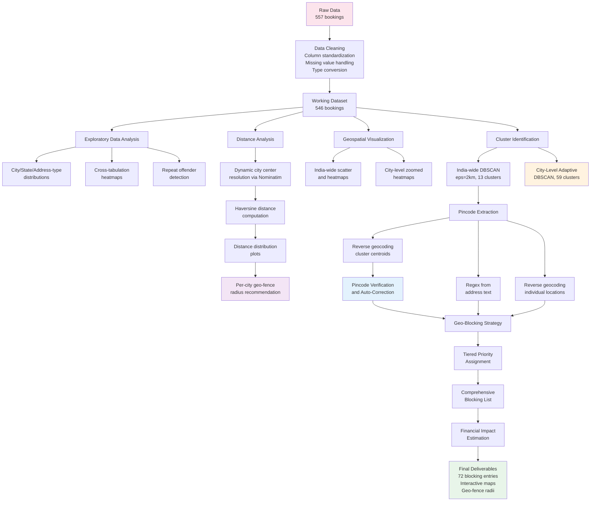
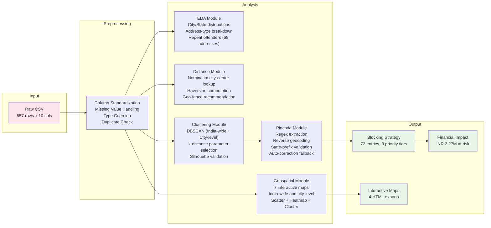
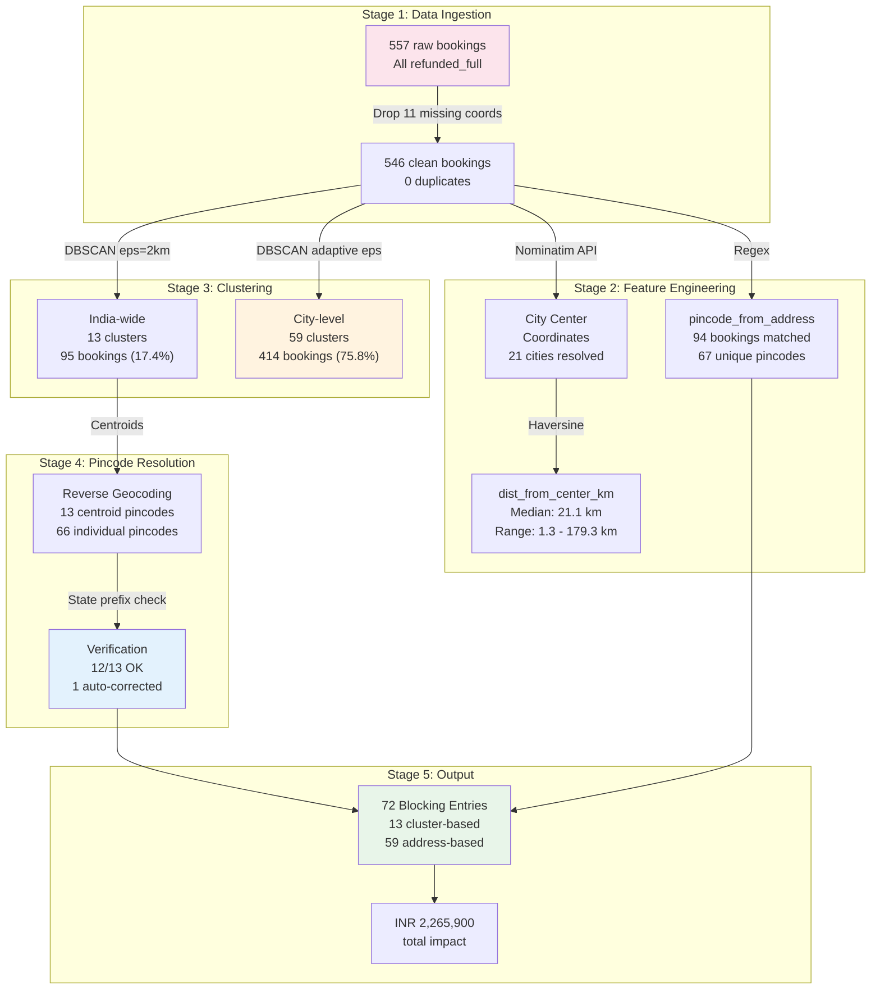
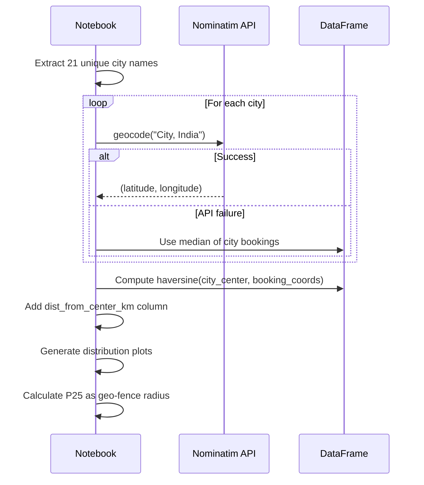
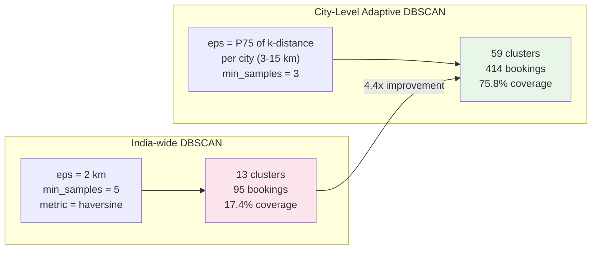
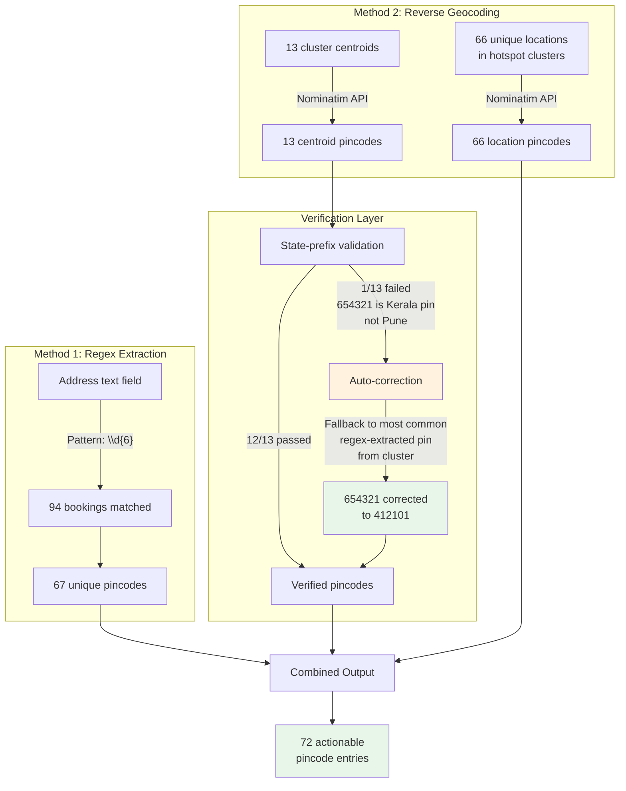
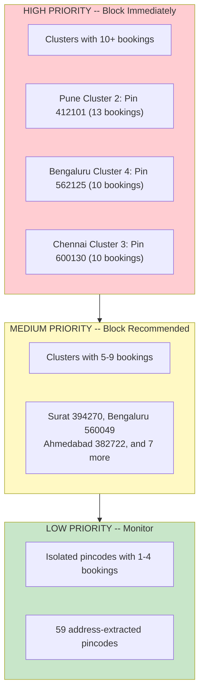
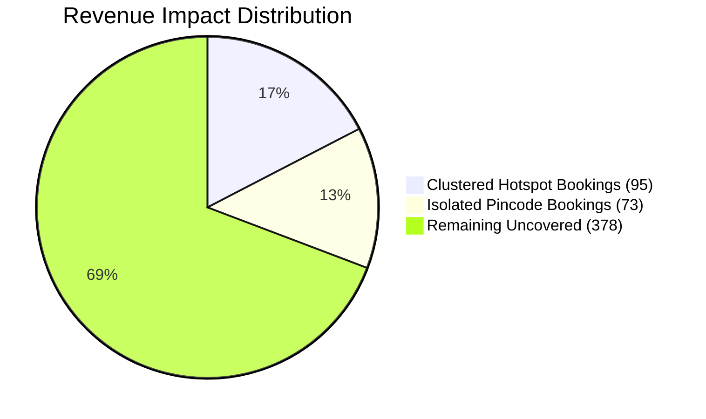

# COOX Outskirt Booking Analysis and Geo-Blocking Strategy

**Tech GC 2026 | IIT Roorkee x COOX Problem Statement**

---

## Table of Contents

- [Problem Statement](#problem-statement)
- [Executive Summary](#executive-summary)
- [Key Results](#key-results)
- [Methodology](#methodology)
- [Pipeline Architecture](#pipeline-architecture)
- [Data Flow](#data-flow)
- [Distance Analysis](#distance-analysis)
- [Clustering Strategy](#clustering-strategy)
- [Pincode Extraction Pipeline](#pincode-extraction-pipeline)
- [Geo-Blocking Recommendation](#geo-blocking-recommendation)
- [Financial Impact](#financial-impact)
- [Repository Structure](#repository-structure)
- [Setup and Execution](#setup-and-execution)
- [Tech Stack](#tech-stack)
- [Limitations and Future Work](#limitations-and-future-work)

---

## Problem Statement

COOX is a chef-at-home services platform that receives bookings from locations outside its serviceable areas -- typically city outskirts, remote farmhouses, and industrial zones. These bookings are unfulfillable and result in full refunds, causing:

- Revenue leakage from processing failed orders
- Operational overhead from customer support handling refund requests
- Degraded customer experience from order cancellations

**Objective:** Analyze historical non-serviceable booking data to identify geographic patterns, extract actionable pincodes, and recommend a data-driven geo-blocking strategy to prevent future cancellations.

---

## Executive Summary

This analysis processes 557 non-serviceable (fully refunded) bookings across 14 Indian states and 21 cities. Through a multi-stage pipeline combining exploratory analysis, geospatial visualization, density-based clustering, automated pincode extraction, and distance-from-center analysis, we deliver:

1. A comprehensive understanding of where and why bookings fail geographically
2. A quantified definition of "outskirt" using dynamic city-center resolution
3. A tiered geo-blocking recommendation covering 72 pincode entries
4. Per-city geo-fence radius recommendations derived from booking distance distributions
5. Estimated financial impact of INR 2.27M with projected annual savings of INR 1.81M

---

## Key Results

| Metric | Value |
|--------|-------|
| Raw Dataset | 557 bookings, 10 columns |
| Working Dataset | 546 bookings (11 dropped for missing coordinates) |
| Cities Covered | 21 across 14 states |
| Top 3 Problem Cities | Bengaluru (26.2%), Pune (17.2%), Hyderabad (12.5%) |
| Median Distance from City Center | 21.1 km |
| Maximum Distance | 179.3 km |
| India-wide DBSCAN Clusters | 13 clusters, 95 bookings (17.4%) |
| City-Level Adaptive DBSCAN | 59 clusters, 414 bookings (75.8%) |
| Silhouette Score | 0.940 (excellent separation) |
| Pincodes Extracted (Regex) | 67 unique pincodes from 94 bookings |
| Pincodes Extracted (Geocoding) | 13 cluster centroids + 66 individual locations |
| Comprehensive Blocking Entries | 72 (13 clusters + 59 isolated pincodes) |
| Total Bookings Addressable | 168 / 546 (30.8%) |
| Estimated Revenue Impact | INR 2,265,900 |
| Projected Annual Savings | INR 1,812,720 (at 80% prevention rate) |

---

## Methodology



---

## Pipeline Architecture



---

## Data Flow



---

## Distance Analysis

The distance analysis provides a quantitative, data-driven definition of "outskirt" by dynamically resolving each city's official center coordinates through Nominatim (OpenStreetMap) and computing the haversine distance for every booking.

### How It Works



### Recommended Geo-Fence Radii

The 25th percentile of outskirt booking distances is used as the recommended geo-fence radius. Blocking bookings beyond this radius would prevent approximately 75% of non-serviceable bookings for each city.

| City | Bookings | Min Distance | Median Distance | Suggested Geo-fence |
|------|----------|-------------|-----------------|---------------------|
| Bengaluru | 143 | 10.3 km | 22.1 km | 19 km |
| Pune | 94 | 6.5 km | 19.5 km | 15 km |
| Hyderabad | 68 | 15.4 km | 26.2 km | 22 km |
| Chennai | 66 | 13.2 km | 26.5 km | 21 km |
| Ahmedabad | 38 | 10.1 km | 15.8 km | 14 km |
| Jaipur | 25 | 12.5 km | 20.8 km | 16 km |

---

## Clustering Strategy

### Dual DBSCAN Approach

Two levels of DBSCAN clustering are applied to maximize coverage:



### Why DBSCAN

- Does not require pre-specifying the number of clusters (unlike K-Means)
- Handles arbitrary geographic cluster shapes (outskirts are not circular)
- Identifies noise points (isolated bookings that do not belong to any cluster)
- Uses haversine distance metric for accurate geographic distance on Earth's surface

### Parameter Selection

- **eps (India-wide):** Selected via k-distance plot elbow method at 2 km
- **eps (City-level):** Adaptive, computed as the 75th percentile of k-distance per city, clamped between 3 km and 15 km
- **min_samples (India-wide):** 5 (standard geographic clustering minimum)
- **min_samples (City-level):** 3 (lower threshold to capture smaller city-specific patterns)
- **Silhouette Score:** 0.940 (indicates strong cluster cohesion and separation)

### City-Level DBSCAN Results

| City | eps (km) | Clusters | Clustered Bookings | Total | Coverage |
|------|----------|----------|--------------------|-------|----------|
| Bengaluru | 4.1 | 14 | 113 | 143 | 79.0% |
| Pune | 4.0 | 7 | 70 | 94 | 74.5% |
| Hyderabad | 7.4 | 7 | 54 | 68 | 79.4% |
| Chennai | 3.6 | 9 | 50 | 66 | 75.8% |
| Ahmedabad | 4.1 | 3 | 31 | 38 | 81.6% |
| Jaipur | 8.7 | 3 | 21 | 25 | 84.0% |
| Kolkata | 8.9 | 3 | 16 | 18 | 88.9% |

---

## Pincode Extraction Pipeline



---

## Geo-Blocking Recommendation

### Priority Tiers



### Strategy Overview

| Strategy | Method | Clusters/Entries | Bookings Covered |
|----------|--------|-----------------|------------------|
| Zone-Based Blocking | India-wide DBSCAN hotspots | 13 cluster pincodes | 95 (17.4%) |
| Pincode-Level Blocking | Address regex extraction | 59 isolated pincodes | 73 (13.4%) |
| Combined | Both strategies merged | 72 total entries | 168 (30.8%) |
| City-Level Insight | City-adaptive DBSCAN | 59 local clusters | 414 (75.8%) |

---

## Financial Impact



| Metric | Value |
|--------|-------|
| Average Order Value (estimated) | INR 4,000 |
| Processing Cost per Failed Booking | INR 150 |
| Total Revenue at Risk | INR 2,184,000 |
| Total Processing Waste | INR 81,900 |
| **Total Estimated Impact** | **INR 2,265,900** |
| Projected Annual Savings (80% prevention) | INR 1,812,720 |
| Projected Monthly Savings | INR 151,060 |

---

## Repository Structure

```
oox-outskirt-geoblocking-analysis/
|-- README.md                               # This file
|-- COOX_Outskirt_Analysis_final.ipynb      # Complete notebook with execution outputs
|-- data/
|   |-- IIT Roorkee __ COOX - Raw Data.csv  # Source dataset (557 rows)
|-- maps/                                    # Exported interactive maps
    |-- 01_scatter_map.html                  # All booking locations
    |-- 02_density_heatmap.html              # Booking density visualization
    |-- 03_cluster_heatmap.html              # Cluster-only density
    |-- 04_blocking_zones.html               # Final blocking recommendation
```

---

## Setup and Execution

### Prerequisites

- Python 3.10 or higher
- Google Colab (recommended) or Jupyter Notebook

### Dependencies

```
pandas
numpy
matplotlib
seaborn
folium
scikit-learn
geopy
```

### Running the Notebook

1. Open `COOX_Outskirt_Analysis_final.ipynb` in Google Colab
2. Upload the CSV file from `data/` to the Colab file panel
3. Select `Runtime` then `Run All`
4. Wait approximately 5-8 minutes for completion (API rate-limited sections)

### Runtime Notes

- Section 3.1 (City Center Resolution): Calls Nominatim API for 21 cities with 1.5s rate limiting
- Section 6 (Pincode Extraction): Calls Nominatim API for 13 centroids + 66 individual locations
- All other sections execute in under 10 seconds each

---

## Tech Stack

| Component | Technology | Purpose |
|-----------|-----------|---------|
| Data Processing | pandas, numpy | Cleaning, aggregation, feature engineering |
| Visualization | matplotlib, seaborn | Static charts and distribution plots |
| Geospatial Maps | folium | Interactive scatter maps, heatmaps, cluster maps |
| Clustering | scikit-learn (DBSCAN) | Density-based geographic clustering |
| Geocoding | geopy (Nominatim) | City center resolution, reverse geocoding |
| Distance | Custom haversine | Haversine formula for geographic distance |

---

## Limitations and Future Work

### Current Limitations

- **No temporal data:** The dataset lacks timestamps, preventing trend analysis and seasonality detection
- **No revenue column:** Financial impact relies on industry-average estimates rather than actual booking values
- **Free geocoding API:** Nominatim rate limits and occasional inaccuracies (e.g., the 654321 pincode issue, auto-corrected)
- **Static dataset:** Analysis represents a snapshot; production would require continuous ingestion

### Recommended Enhancements

- Integrate with COOX internal API for real-time booking validation
- Replace Nominatim with India Post official pincode database for verification
- Add temporal dimension when timestamp data becomes available
- Implement automated model retraining pipeline as new booking data accumulates
- Build a dashboard (Streamlit or Metabase) for operations team visibility
- A/B test geo-blocking rules to measure actual prevention rates

---

## Notebook Sections

| Section | Description | Key Output |
|---------|-------------|-----------|
| 1. Setup and Data Loading | Import libraries, load CSV | 557 rows x 10 columns |
| 2. Data Cleaning | Column standardization, missing values, type conversion | 546 clean bookings |
| 3. Exploratory Data Analysis | City/state/address distributions, repeat offenders | Top 20 problem areas |
| 3.1 Distance Analysis | Dynamic city-center resolution, haversine distance | Median 21.1 km, geo-fence radii |
| 4. Geospatial Visualization | Scatter maps, density heatmaps, city-level zoomed maps | 7 interactive maps |
| 5. Cluster Identification | India-wide DBSCAN, k-distance plot, silhouette validation | 13 clusters, 0.940 score |
| 5.2 City-Level DBSCAN | Adaptive per-city clustering | 59 clusters, 75.8% coverage |
| 6. Pincode Extraction | Regex + reverse geocoding + verification + auto-correction | 72 actionable pincodes |
| 7. Geo-Blocking Recommendation | Tiered priority table, comprehensive blocking list | 168 bookings addressable |
| 7.1 Isolated Locations | Non-clustered booking analysis | 451 isolated bookings |
| 8. Limitations and Future Work | Scope constraints and enhancement roadmap | 6 recommendations |
| 9. Executive Summary | Consolidated findings and recommendations | Final deliverable |

---

*This analysis was conducted as part of the Tech GC 2026 competition at IIT Roorkee.*
